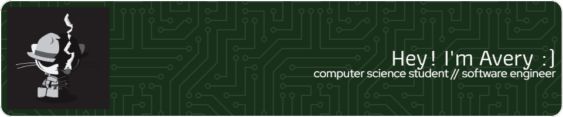

### Hi there 👋

- 🏫 Rowan University Computer Science '24
- 📫 How to reach me: 
  - [personal email](mailto:avery@bobbitt.dev)
  - [work email](mailto:bobbit82@rowan.edu)
- 😄 Pronouns: they/he
- ⚡ Fun fact: I have a cat named Scoober - you can find him on [Instagram](https://www.instagram.com/scoober.t)

<!--
**averybobbitt/averybobbitt** is a ✨ _special_ ✨ repository because its `README.md` (this file) appears on your GitHub profile.

Here are some ideas to get you started:

- 🔭 I’m currently working on ...
- 🌱 I’m currently learning ...
- 👯 I’m looking to collaborate on ...
- 🤔 I’m looking for help with ...
- 💬 Ask me about ...
- 📫 How to reach me: ...
- 😄 Pronouns: ...
- ⚡ Fun fact: ...
-->
